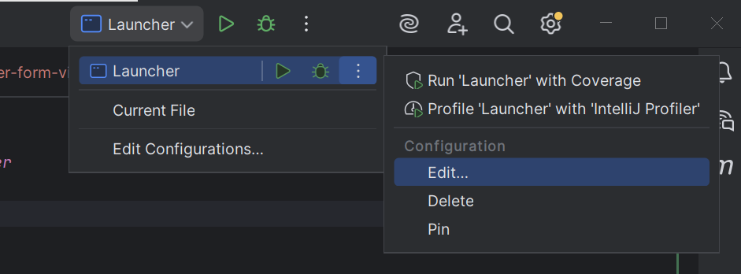
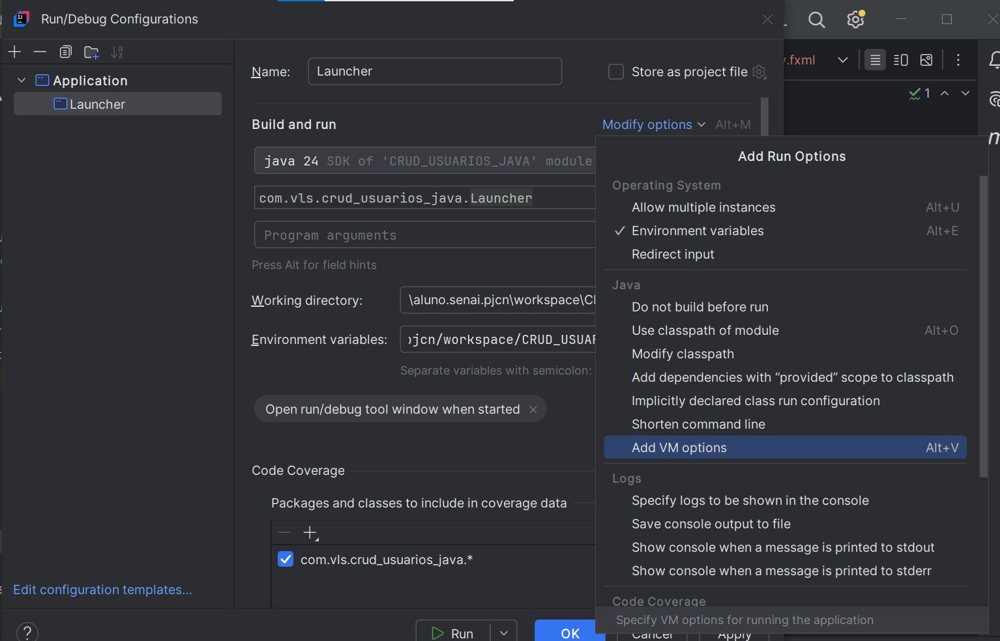
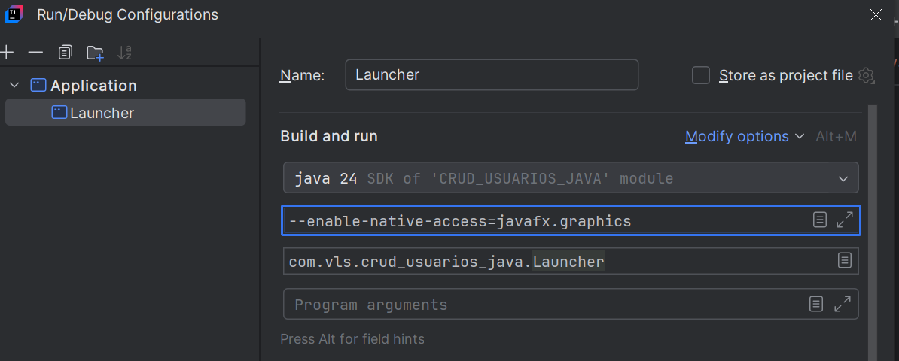

# CRUD Java SQL FX 

## Configuração Launcher

1. Passo 1


2. Passo 2



3. Passo 3

Digite o comando `--enable-native-access=javafx.graphics` no campo de VM adicionado.



## Banco de dados

```MySQL
CREATE DATABASE crud_usuarios_java;
USE crud_usuarios_java;
CREATE TABLE usuarios (
	id INT AUTO_INCREMENT PRIMARY KEY,
    nome VARCHAR(100),
    sobrenome VARCHAR(100),
    dataNascimento DATE,
    telefone VARCHAR(255),
    sexo CHAR(1),
    endereco VARCHAR(255),
    login VARCHAR(50) UNIQUE,
    senha VARCHAR(50),
    email VARCHAR(100)
);

INSERT INTO usuarios (nome, login, senha) 
VALUES ("Fulano","LoginFulano","123456");

INSERT INTO usuarios (nome, login, senha) 
VALUES ("Ciclano","LoginCiclano","123456"),
("Beltrano","LoginBeltrano","123456"),
("Fano","LoginFano","123456");


SELECT * FROM usuarios;

```